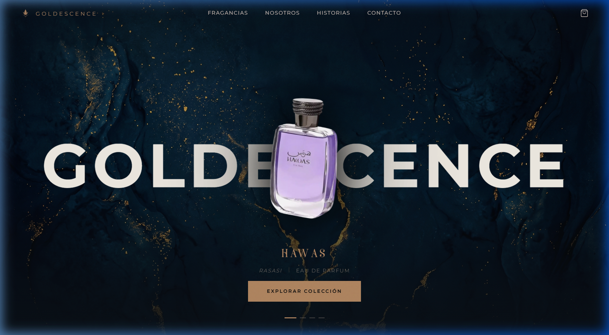
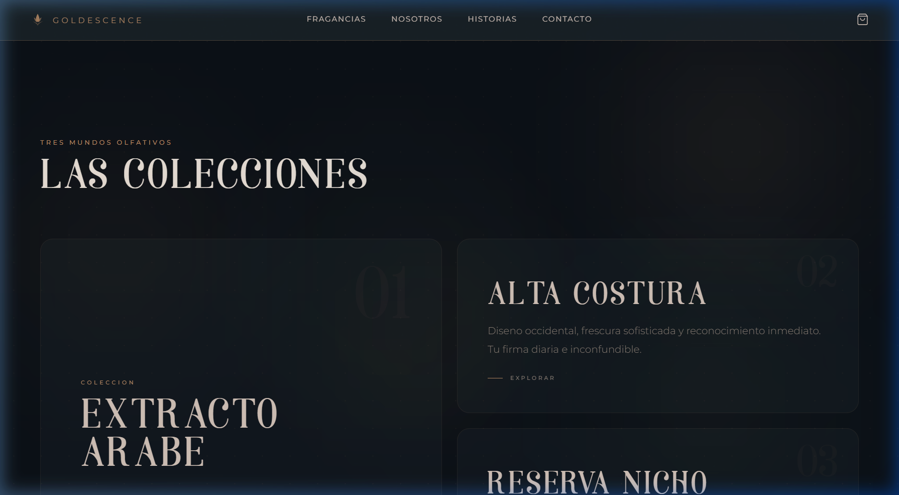
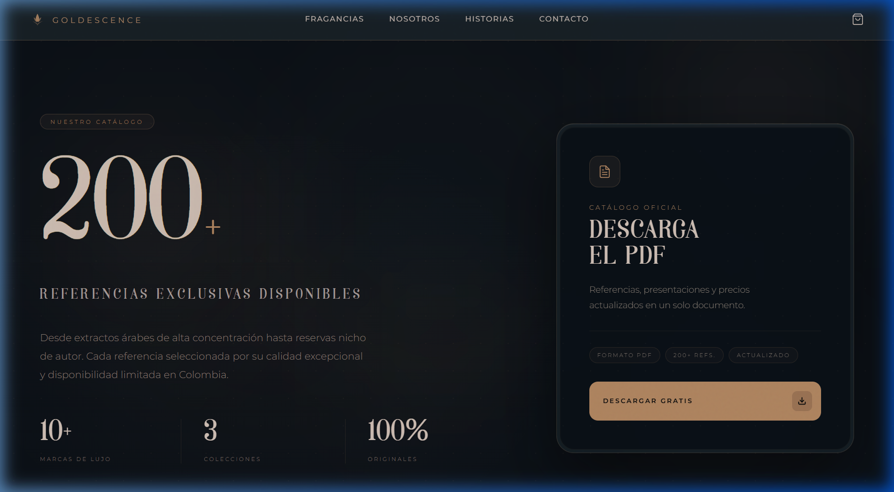

# GOLDESCENCE — Alta Perfumería 🏺



**GOLDESCENCE** es una plataforma de comercio electrónico de lujo dedicada a la alta perfumería de nicho, diseñador y árabe. Ubicados en Nariño, Colombia, ofrecemos más de 200 referencias exclusivas en formatos originales y decants.

## ✨ Características Principales

- **Diseño Editorial de Lujo**: Una interfaz inmersiva con estética "dark mode" y acentos dorados que evocan exclusividad.
- **Experiencia Interactiva**: Efectos de parallax dinámicos, animaciones fluidas y transiciones suaves.
- **Catálogo Digital**: Acceso directo al catálogo completo de fragancias en formato PDF.
- **Diseño Responsivo**: Totalmente optimizado para dispositivos móviles y escritorio.
- **Secciones Destacadas**:
    - **La Reserva**: Selección exclusiva de perfumes de nicho.
    - **Colecciones**: Exploración por tipos de fragancias.
    - **Filosofía**: Historia y valores de la marca.

## 📸 Capturas de Pantalla

### Colecciones Exclusivas


### Catálogo y Reservas


## 🛠️ Tecnologías Utilizadas

- **Core**: React 18 con TypeScript
- **Bundler**: Vite
- **Estilos**: Vanilla CSS con variables modernas
- **Framework de UI**: Componentes personalizados para máxima flexibilidad y rendimiento.
- **Animaciones**: GSAP / CSS Transitions

## 🚀 Instalación y Desarrollo

1. Clona el repositorio:
   ```bash
   git clone https://github.com/alejor21/GOLDESSENCE.git
   ```

2. Instala las dependencias:
   ```bash
   npm install
   ```

3. Inicia el servidor de desarrollo:
   ```bash
   npm run dev
   ```

4. Construye para producción:
   ```bash
   npm run build
   ```

---

*Desarrollado con pasión para GoldEssence.*
